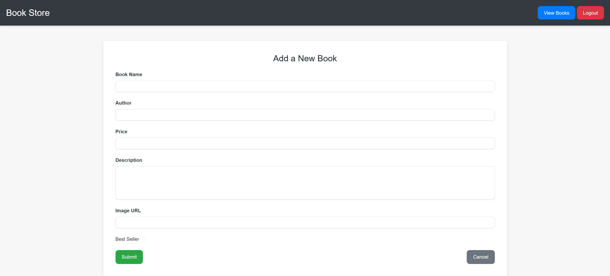
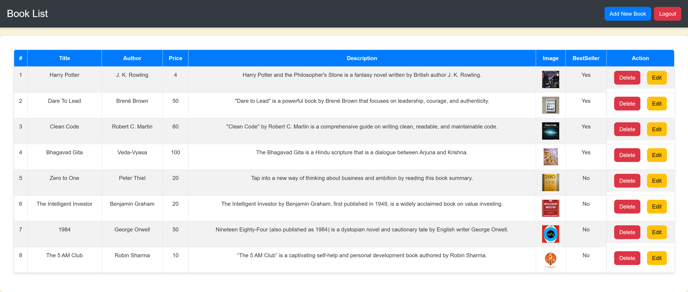
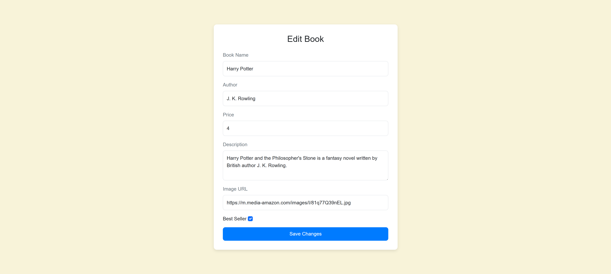

# Book-Store

Setup & Installation

1. Clone the Repository:
  git clone <repository-url>

2. Navigate to the Project Folder:
  cd <project-folder>

3. Install Dependencies:
  npm install

4. Configure MongoDB Connection:
    Update the MongoDB connection settings in the configuration file (e.g., .env).

5. Run the Application:
  npm start


# Book Store Website

This project is a full-stack Book Store website that connects to MongoDB. It allows users to view books and categories (e.g., Best Seller and New) and enables an admin to manage the books (add, edit, and delete) through a secure interface.

---

> Ensure that clients can understand your application, and developers can easily follow your code structure. If the jury suggests changes, note them down and implement them as required.

---

## Table of Contents

- [Overview](#overview)
- [Features](#features)
- [Technologies Used](#technologies-used)
- [System Architecture](#system-architecture)
- [API Documentation](#api-documentation)
- [Admin Interface](#admin-interface)
- [User Interface](#user-interface)
- [Setup & Installation](#setup--installation)
- [Usage](#usage)
- [Future Enhancements](#future-enhancements)
- [License](#license)

---

## Overview

The Book Store Website is designed to display a collection of books that are stored in a MongoDB database. The project has two major components:

1. **User Interface:**  
   - Displays all books retrieved from the database.
   - Categorizes books as **Best Seller** (if marked by the admin) or **New**.

2. **Admin Interface:**  
   - **Admin Login:** Uses a static array to validate admin credentials.
   - **Book Management:**  
     - **Add Book:** Admin can add a new book using a form.
     - **Edit & Delete Book:** After login, the admin is provided with a table-based dashboard where each row (book) has options to edit or delete the book.

---

## Features

- **Live Project:** The project is hosted on Render with the domain: 
    https://book-store-guuf.onrender.com/


- **CRUD Operations:**  
- Create: Add new books.
- Read: View the list of all books.
- Update: Edit book details.
- Delete: Remove books from the database.
- **Book Categorization:**  
- Books can be tagged as **Best Seller** (if the admin marks them) or show up under **New** if not.
- **Secure Admin Access:**  
- Admin login is implemented using static credentials (editable in the code).

---

## Technologies Used

- **Backend:** Node.js and Express (assumed based on the structure)
- **Database:** MongoDB
- **Frontend:** HTML, CSS, BootStrap and JavaScript (for both the user and admin interfaces)
- **Hosting:** Render

---

## System Architecture

1. **Database Layer:**  
 MongoDB stores all the book data with fields such as name, price, author, description, and a Boolean flag for Best Seller.

2. **Server/API Layer:**  
 The backend server exposes RESTful API endpoints to perform CRUD operations on the book data.

3. **Client Layer:**  
 - **User Side:** Displays book lists fetched via the API.
 - **Admin Side:** Provides forms and a table dashboard for managing book data.

---


### 1. Fetch All Books

- **Endpoint:** `GET /books`
- **Description:** Retrieves all books from the database.
- **Response Example:**
  ```json
  [
    {
      "_id": "book_id_here",
      "name": "Book Name",
      "price": 10.99,
      "author": "Author Name",
      "description": "Book description here",
      "bestSeller": true
    }
  ]

2. Add a New Book
  Endpoint: POST /books/add
  Description: Adds a new book to the database.
  Request Body Example:

  {
  "name": "Book Name",
  "price": 10.99,
  "author": "Author Name",
  "description": "A brief description of the book",
  "bestSeller": true
}


Response Example:

  {
  "message": "Book added successfully",
  "book": {
    "_id": "generated_book_id",
    "name": "Book Name",
    "price": 10.99,
    "author": "Author Name",
    "description": "A brief description of the book",
    "bestSeller": true
  }
}

3. Update a Book
  Endpoint: PUT /books/update/:id
  Description: Updates the details of an existing book.
  Request Body Example:

  {
  "name": "Updated Book Name",
  "price": 12.99,
  "author": "Updated Author",
  "description": "Updated description",
  "bestSeller": false
}

Response Example:

{
  "message": "Book updated successfully"
}

4. Delete a Book
  Endpoint: DELETE /books/delete/:id
  Description: Deletes a book from the database.
  Response Example:
  {
  "message": "Book deleted successfully"
}

Admin Interface

1. Admin Login
  Authentication:
  Admin credentials are stored in a static array. Only users with valid email and password can log in.

Example Credentials in Code:
  const admins = [
  {
    email: "admin@example.com",
    password: "adminpassword"
  }
];

2. Book Management Dashboard
  After a successful login, the admin is directed to the dashboard which includes:

  Add Book Form:
  A form to add new books. The fields include:

  Book Name
  Price
  Author
  Description
  Best Seller Checkbox (if checked, the book is marked as Best Seller)
  Books Management Table:
  A table listing all books with options to:

  Edit: Modify existing book details.
  Delete: Remove the book from the database.
  This table provides a clear, structured view of all the books and is designed to make management simple and efficient.

  User Interface
  The user interface displays all books from the database.
  Books are categorized as Best Seller or New based on the admin’s input.
  Users can browse through the collection and view details about each book.

  # screenshorts
  1. Login.ejs
  
  2. BookForm.ejs
  
  3. BookList.ejs
 
  4. Edit.ejs 
  
  5. Index.ejs
  .png>)


